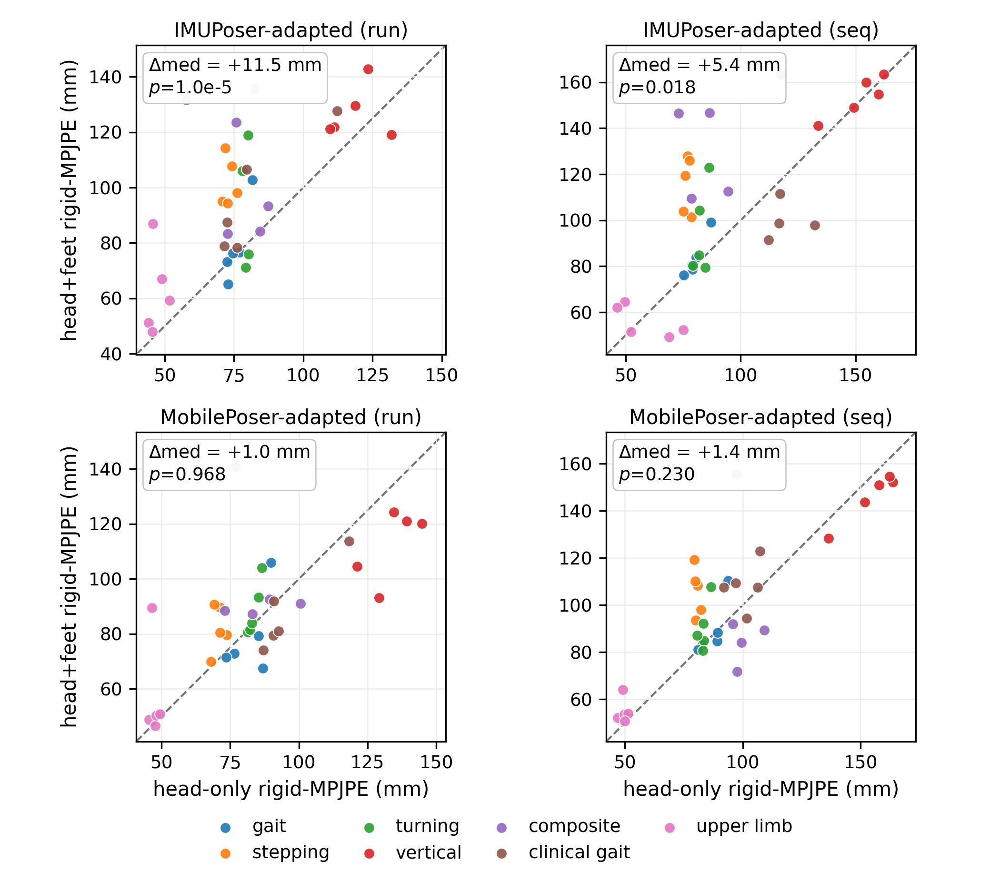

# One Sensor, Whole Body

*3D Body Pose from a Single Consumer Earbud IMU*

### [arXiv](https://arxiv.org/abs/2609.34978) | [ACM Digital Library](https://doi.org/10.1145/3841192.3841753)

**[Zhilin Guo](https://zhilinguo.github.io/)¹, [Boqiao Zhang](https://boqiaoz00.github.io/boqiao_steven_zhang.github.io/)¹, Oszkár Urbán¹, [Josef Bengtson](https://www.chalmers.se/en/persons/bjosef/)², [Hakan Aktas](https://scholar.google.com/citations?user=RxjN5w4AAAAJ&hl=en)¹, [Wenzhao Li](https://wenzhao-cam.github.io/)¹, [Siyu Hong](https://www.linkedin.com/in/siyuhong/)¹, [Kyle Fogarty](https://kyle-fogarty.github.io/)¹, [Chenliang Zhou](https://chenliang-zhou.github.io/)¹, Ali Senguel¹, [Cengiz Oztireli](https://sites.google.com/view/cengiz-oztireli-intro/home)¹**

¹ University of Cambridge &nbsp;&nbsp;·&nbsp;&nbsp; ² Chalmers University of Technology

> Consumer earbuds already stream inertial motion data from the head, one of the most widely worn sensor locations on the body. We ask how much of the 3D body pose a single such head IMU can recover, and whether adding more consumer sensors actually helps. We build a multimodal capture pipeline that records four-view RGB-D video together with an AirPods head IMU and two Striv insole IMUs, synchronize the streams post-hoc, and generate pseudo-ground-truth with SAM 3D Body, yielding a 35-take single-subject benchmark spanning gait, turning, vertical, everyday, and clinically inspired motions. Adapting two recurrent model families (IMUPoser and MobilePoser), we show that one head IMU recovers lower-body pose at 79.0 mm rigid-MPJPE and per-foot ground contact at 0.809 macro-F1, and that a causal variant retains most of this accuracy at streaming latency. In paired per-take significance tests across both families, adding the consumer foot IMUs never significantly improves pose and significantly degrades it in two of four model–split combinations; a mounting-bias probe and feet-only ablation identify insole orientation quality, not foot placement, as the mechanism. Extending the output to a 20-joint full-body skeleton maps the boundary: gross distal-arm motion is partially recoverable from the head alone, proximal upper-body pose is not, and staged fine-tuning recovers the leg accuracy that naive joint training sacrifices to multi-task dilution. For learned pose from consumer wearables, sensor reliability, not sensor count, is the binding constraint here. For the devices tested, the earbud is its sweet spot.



**Adding consumer foot IMUs never significantly improves pose — and often significantly degrades it.** *Paired per-take head-only (x) vs. head+feet (y) rigid-MPJPE across both model families and evaluation splits; points above the diagonal favour head-only.*

---

## Folder structure

After installation and data setup the repository should look like this:

```
one-sensor-whole-body/
├── oswb/                  # package: data, models, calibration, CV engine
├── command/               # paper-result scripts (pretrain / eval / analysis)
├── data/
│   ├── smpl/              # SMPL male model pkl (license-gated, see INSTALL.md)
│   ├── amass/             # AMASS sub-datasets (license-gated)
│   ├── synthetic/AMASS/   # generated virtual-IMU tensors (synth_amass.py)
│   └── processed/         # 35-take benchmark (released separately)
├── results/               # created by training/eval (checkpoints + metrics)
├── pretrain.py            # synthetic pretraining (IMUPoser-adapted)
├── mobileposer.py         # MobilePoser-adapted pretraining + CV
├── eval.py                # cross-validated fine-tuning + evaluation
├── eval_contact.py        # auxiliary foot-contact prediction
├── significance.py        # paired per-take significance tests + figure
└── synth_amass.py         # AMASS -> virtual head/foot IMU synthesis
```

## Installation

Our code is tested on Ubuntu 24.04 with an NVIDIA A100, CUDA 12.1, PyTorch 2.5.1.

See **[INSTALL.md](INSTALL.md)** for environment setup, the license-gated SMPL model, and AMASS download instructions.

## Data Preparation

| Data | Source | Path |
|------|--------|------|
| SMPL male model | [smpl.is.tue.mpg.de](https://smpl.is.tue.mpg.de/) (registration required) | `data/smpl/basicmodel_m_lbs_10_207_0_v1.0.0.pkl` |
| AMASS (CMU, BioMotionLab_NTroje, MPI_HDM05) | [amass.is.tue.mpg.de](https://amass.is.tue.mpg.de/) (registration required) | `data/amass/<Dataset>/` |
| Synthetic virtual-IMU tensors | generated by `python synth_amass.py` | `data/synthetic/AMASS/` |
| 35-take benchmark | **to be released** — watch this repository | `data/processed/` |

The captured benchmark (aligned earbud + insole IMU streams with SAM 3D Body pseudo-GT labels, ~90 MB) will be released separately; this README will be updated with a download link. Until then, synthetic pretraining runs standalone, and all commands below are ready to run once `data/processed/` is in place.

## Training

All commands are run from the repository root. Pretraining is synthetic-only (40 epochs per variant):

```bash
bash command/pretrain.sh
```

This trains all four variants: the IMUPoser-adapted BiLSTM (main model), its causal streaming variant, the 20-joint full-body extension, and the MobilePoser-adapted baseline. Checkpoints land in `results/baselines/<name>/ckpt.pt`.

## Evaluation

All evaluation is cross-validated over the 35 takes (leave-one-run-out and leave-one-motion-out splits), with per-take fine-tuning (20 epochs) from the synthetic checkpoint. Each script prints per-take and summary metrics and writes `results/eval/cv_<tag>.json`. A single cross-validated evaluation takes roughly 25 minutes (run split) or 35 minutes (seq split) on an A100; `eval_main.sh` runs all configurations sequentially, so expect it to take several hours.

**Main results (Table 1)** — controls, IMUPoser-adapted, and MobilePoser-adapted rows:

```bash
bash command/eval_main.sh
```

Expected headline numbers (rigid-MPJPE, mm; see the paper for the full table):

| Row | run split | seq split |
|-----|-----------|-----------|
| Constant mean-pose prior | 105.5 | 105.5 |
| **Head IMU only (IMUPoser-adapted)** | **79.0** | 92.6 |
| Head IMU only, causal | 92.9 | 91.5 |
| Feet only | 133.5 | 129.7 |
| Head+feet | 95.8 | 107.4 |
| **Head IMU only (MobilePoser-adapted)** | **85.5** | 93.7 |
| Head+feet (MobilePoser-adapted) | 86.9 | 99.1 |

> **Data version.** The released benchmark is produced with an updated insole-orientation processing pipeline that supersedes the version used at publication time. Head-only results are unaffected and reproduce as printed; rows that consume the foot IMUs (feet-only, head+feet, no-calibration, and the mounting-bias probe) will evaluate to different values on the released data. The update and its effect on the shared rows are documented in the companion repository, [reliability-gated-imu-fusion](https://github.com/ZhilinGuo/reliability-gated-imu-fusion).

**Paired significance tests** — head-only vs. head+feet across both families and both splits (Holm-corrected), plus the paired-scatter figure:

```bash
bash command/significance.sh   # requires eval_main.sh outputs
```

**Foot contact from the head IMU** — 0.809 macro-F1, pose preserved (77.0 mm):

```bash
bash command/eval_contact.sh
```

**Mounting-bias probe** — injects a constant random sensor-to-bone foot rotation per take (σ ∈ {5°, 10°, 20°, 40°}, three draws each); degradation is monotonic past σ = 10°, reaching 118.9 ± 1.2 mm at σ = 40°:

```bash
bash command/eval_bias_probe.sh
```

**Full-body extension** — naive vs. weak-spine-supervision vs. staged fine-tuning on the 20-joint skeleton (three seeds); staged recovers the legs to 86.2 ± 7.2 mm with distal-arm signal intact:

```bash
bash command/eval_fullbody.sh
```

## Evaluation Protocol Details

- **Splits:** leave-one-run-out (5 groups, one capture session each) and leave-one-motion-out (7 motion classes); every take is held out exactly once per split.
- **Fine-tuning:** per fold, 20 epochs, lr 1e-4, batch 32, window 150 frames; only the held-in takes are used.
- **Metrics:** rigid-MPJPE (mm) after per-take rigid alignment of the lower-body skeleton, motion R² against the constant mean-pose prior, distal (ankle) variants, MPJVE (mm/s), and PA-MPJPE (mm).
- **Significance:** paired per-take tests across the 35 takes, Holm-corrected within each family–split comparison.

## Citation

If you use this work, please cite:

```bibtex
@inproceedings{guo2026onesensor,
  title     = {One Sensor, Whole Body --- 3D Body Pose from a Single Consumer Earbud IMU},
  author    = {Guo, Zhilin and Zhang, Boqiao and Urb{\'a}n, Oszk{\'a}r and Bengtson, Josef and Aktas, Hakan and Li, Wenzhao and Hong, Siyu and Fogarty, Kyle and Zhou, Chenliang and Senguel, Ali and Oztireli, Cengiz},
  booktitle = {The 6th International Workshop on Human-centric Multimedia Analysis (HUMA '26), ACM Multimedia},
  year      = {2026},
  doi       = {10.1145/3841192.3841753}
}
```

## License

This project is licensed under the Apache License 2.0, as found in the [LICENSE](LICENSE) file.

## Acknowledgements

- [IMUPoser](https://github.com/figo2101/IMUPoser) and [MobilePoser](https://github.com/SPARK-Unity/MobilePoser) — the two model families adapted here (reimplemented in this repo; no third-party code is vendored).
- [AMASS](https://amass.is.tue.mpg.de/) and [SMPL](https://smpl.is.tue.mpg.de/) — motion data and body model used for synthetic pretraining.
- [SAM 3D Body](https://github.com/facebookresearch/sam-3d-body) — pseudo-ground-truth labeling of the benchmark.

This work was supported by a UKRI Future Leaders Fellowship [grant number G127262].
